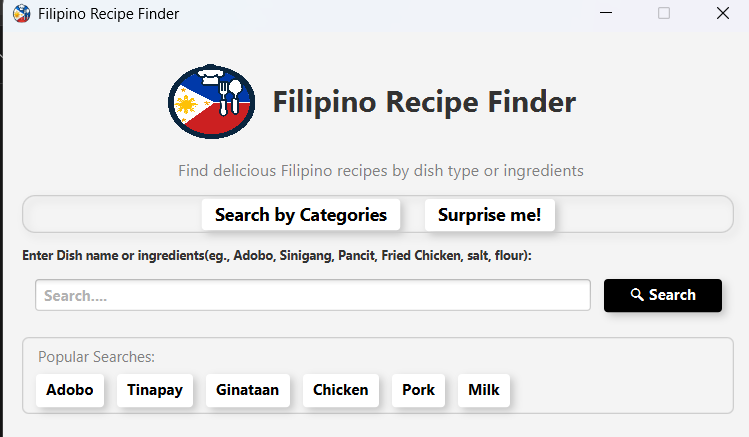
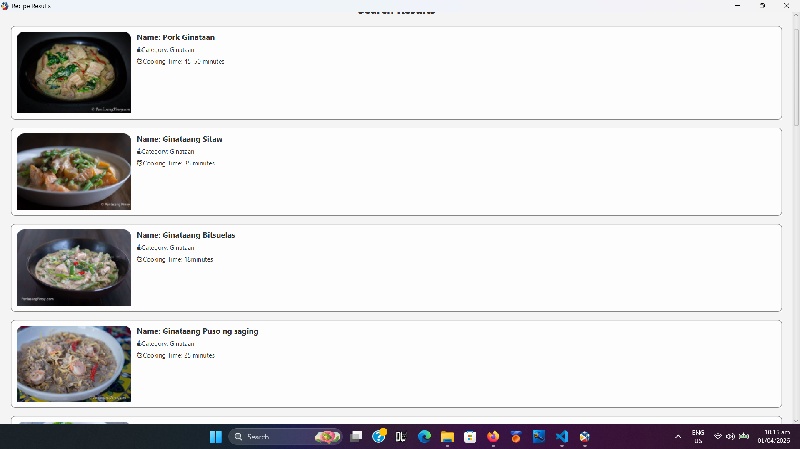

# 🇵🇭 Filipino Recipe Finder

A simple desktop application built using Java and SQLite that allows users to browse and search for Filipino recipes.

This project was developed as an academic requirement and demonstrates fundamental concepts in programming, data handling, and application development.

---

## 📌 Features

* 🔍 Search for Filipino recipes by name
* 📋 View recipe details (ingredients, instructions)
* 💾 Local data storage using SQLite
* 🖥️ Basic graphical user interface (GUI) for navigation

---

## 🛠️ Technologies Used

* Java (Core Java / Swing for GUI)
* SQLite (local database)
* JDBC (Java Database Connectivity)

---

## 🎯 Purpose

The goal of this project was to:

* Practice building a complete application from scratch
* Understand how to connect a Java application to a database
* Implement search functionality using structured data
* Apply basic UI/UX principles

---

## ⚠️ Project Status

🚧 This project is **unfinished** and was developed under a tight academic deadline.

* The GUI design is minimal and follows a basic layout
* Some features may be incomplete or unoptimized
* Future improvements can include better UI design and additional functionality

---

## 🚀 Possible Improvements

* Improve user interface (modern design / better UX)
* Add filtering (by ingredients, category, cooking time)
* Enhance search functionality
* Add recipe images
* Convert into a web-based application

---

## 👨‍💻 Author

**Rafael Luaña**

* Aspiring Developer & Technical Support Specialist
* Currently improving skills in web development and programming

---

## 📄 Notes

This project highlights my ability to:

* Work independently on a complete application
* Manage time under pressure
* Apply programming fundamentals in a real-world scenario
* 
## Screenshots

---
